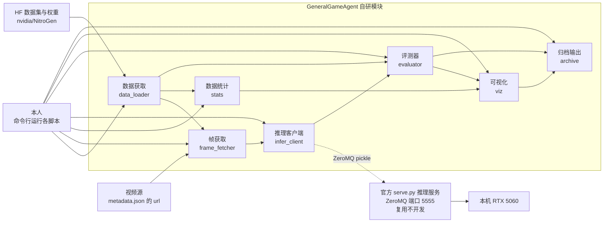

# 模块设计与职责表

> 第 2 天（2026-08-20）| 对应立项书 M1~M7 | 负责人：本人（独立完成）
> 依据：官方仓库源码（serve.py / inference_client.py / inference_session.py / mm_tokenizers.py）与 HF 数据集 README 实测查证

## 1. 主路径一句话

下载单款游戏的标注分片 → 按 metadata 从原始视频抽取对应帧 → 帧送官方推理服务（serve.py）得预测动作 → 与人类标注对齐计算指标 → 可视化对比 → 归档代码、指标表与实验报告。

## 2. 模块图

说明：外部使用者只有本人（命令行）；`serve.py` 为官方组件原样复用（M1 验收锚点），与自研模块通过 ZeroMQ 通信；权重 `ng.pt` 与数据分片存放于仓库外（`_models/`、`_data/`），不入 git。

## 3. 职责表

| 模块 | 名称 | 输入 | 输出 | 依赖 | 负责 |
|------|------|------|------|------|------|
| A | 数据获取 data_loader | 分片号（如 SHARD_0000） | 解包后的 parquet 路径清单 + chunk 元数据索引 | hf-mirror、tarfile、polars | 本人 |
| B | 帧获取 frame_fetcher | chunk 的 metadata.json（视频 url、起止时间、遮挡 bbox） | 与标注逐帧对齐的帧图像序列（PNG/ndarray，已应用遮挡） | yt-dlp、opencv、metadata 中的 bbox | 本人 |
| C | 数据统计 stats | actions parquet（同一游戏 ≥500 帧） | 按键频率表、摇杆分布图、≥10 条序列可视化素材 | polars、matplotlib | 本人 |
| D | 推理客户端 infer_client | 单帧 RGB 图像（H,W,3） | 8 步动作块预测：buttons / j_left / j_right | nitrogen.inference_client.ModelClient | 本人 |
| E | 评测器 evaluator | 预测动作块 + 人类标注（测试集 ≥200 帧，与统计数据隔离） | 指标表：按键准确率、摇杆 MSE、相关系数；逐帧明细 CSV | numpy、polars | 本人 |
| F | 可视化 viz | 帧、预测、标注三方数据 | 序列图、双线叠加动作曲线（≥20 段）、差异最大 5 帧标注 | matplotlib | 本人 |
| G | 归档输出 archive | 各模块输出 | 指标表（MD/CSV）、实验报告素材（≥3000 字） | — | 本人 |

## 4. 需求 ↔ 模块对照（无悬空模块、无无主需求）

| 立项书需求 | 负责模块 |
|-----------|---------|
| M1 推理跑通可复现 | D（+官方 serve.py） |
| M2 单游戏统计与序列可视化 | A + C + B（序列可视化需帧） |
| M3 离线评测脚本 | A + B + E（测试集帧需抽取） |
| M4 zero-shot 基线 | E |
| M5 模型输出 vs 人类标注对比 | B + F |
| M6 归档 | G |
| M7 扩展·可视化工具 | F |

不做清单（实机接入、微调、数据过滤、Open P2P 对照、全库下载、自采数据）均无对应模块，图中不出现。

## 5. 与第 2 天计划的差异说明

1. **新增"帧获取"模块**：计划原模块清单未含此模块。D2 查证 HF 数据集 README 确认数据集仅含动作标注（Parquet + metadata），不含视频本体；帧须按 `metadata.json` 的 `original_video.url` 与 `start/end_time` 从原始视频抽取。此为数据形态事实所迫，非范围扩张。
2. **推理服务通信方式更正**：计划假定 serve.py 为 HTTP 服务，实际为 ZeroMQ REP + pickle 序列化（读官方源码确认），比选表已按事实修正。

## 6. 关键技术事实（查证于官方源码与数据集 README）

| 事实 | 出处 |
|------|------|
| serve.py：ZeroMQ REP 套接字，端口 5555，pickle 序列化，请求类型 reset/info/predict | `NitroGen/scripts/serve.py` |
| 客户端接口：`ModelClient.predict(np.ndarray H,W,3 RGB) → {j_left, j_right, buttons}` | `NitroGen/nitrogen/inference_client.py` |
| `InferenceSession.from_ckpt` 启动时 `input()` 交互选择游戏；`load_model` 硬编码 `model.to("cuda")`（CUDA 必需，CPU 需自写适配层） | `NitroGen/nitrogen/inference_session.py` |
| 模型动作空间：20 键（含 RIGHT_BOTTOM/RIGHT_LEFT/RIGHT_RIGHT 三个拨片键）+ 双摇杆 | `NitroGen/nitrogen/shared.py BUTTON_ACTION_TOKENS` |
| 数据集标注：17 布尔按键列 + j_left/j_right 摇杆（[-1,1]，(-1,-1) 为左上）；`actions_processed` 相对 `actions_raw` 已做质量过滤与按键重映射 | HF 数据集 README |
| 数据组织：SHARD_XXXX/<video_id>/<video_id>_chunk_XXXX/{actions_raw,actions_processed}.parquet + metadata.json；每 chunk 约 20 秒 | HF 数据集 README |
| metadata 含 `bbox_controller_overlay`（训练时用于遮挡画面中的手柄覆盖层）与可选 `bbox_game_area` | HF 数据集 README |
| 数据集规模：约 30k 视频、100 个分片（每个 1.3~1.9GB）；模型权重 ng.pt = 1,974,723,762 字节 | HF 仓库 tree API |
| game mapping 由 ckpt_config 的 src_files 所列 parquet 的 `game` 字段动态构建，本地无对应文件时 serve.py 启动会失败（待拿到 ng.pt 后验证） | `NitroGen/nitrogen/mm_tokenizers.py` + 推断 |
